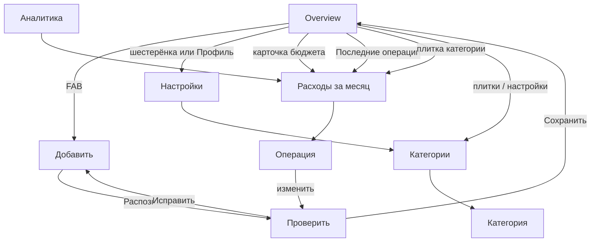

# Функционал учёта расходов

Сейчас есть только вёрстка: кнопки пустые, цифры из [`SampleData.swift`](FinancialApp/Data/SampleData.swift). Цель — замкнуть цикл «добавить → проверить → сохранить → увидеть на главной», затем нарастить ввод и аналитику.

## Как должно работать

Это не банк и не кошелёк. Одна задача: быстро записать трату и понять, укладываюсь ли в месяц.

**Главный цикл (до 15 секунд)**
FAB → ввод → «Распознать» → экран «Проверить» → «Сохранить» → главная обновляется. Распознавание никогда не пишет в базу само: человек всегда видит магазин, сумму, дату и категорию.

**Правда цифр**
- Расход — запись с суммой, магазином, датой, категорией.
- «Расходы в сентябре» = сумма расходов выбранного календарного месяца.
- Полоска бюджета = потрачено / лимит месяца. Красный только при превышении ([`DESIGN.md`](.cursor/rules/DESIGN.md)).
- Четыре плитки = топ категорий этого месяца.
- «Последние операции» = последние 3–5 записей.

**Чего нет в первой версии**
Доходы, счета, долги, мультивалюта, подписки, логин. Валюта только евро через `Money.string`. Вкладка «Профиль» — это настройки, не аккаунт.

**Ввод по этапам (как выбрали)**
1. Текст: человек пишет фразу, парсер достаёт сумму / магазин / дату / категорию.
2. Голос: та же фраза, но из Speech.
3. Чек: фото → OCR → тот же экран проверки.

**iCloud с первого слоя**
SwiftData + private CloudKit. Одни и те же категории и расходы на других устройствах. Сид дефолтных категорий — со стабильными UUID, чтобы не плодить дубли после синка.

## Модель данных

Новые SwiftData-модели (CloudKit-совместимые: опциональные связи, значения по умолчанию, без `.unique`):

- `CategoryEntity` — `title`, `symbol`, `tintRaw`, `sortOrder`, `isArchived`
- `ExpenseEntity` — `merchant`, `amount`, `date`, `note`, `source` (`text` / `voice` / `receipt`), связь на категорию
- `BudgetEntity` — `monthStart`, `limit` (лимит на календарный месяц)
- `AppSettings` — одна запись: текущие предпочтения, флаг сида

Сид при первом запуске: 5 категорий с макета (Продукты, Транспорт, Жильё, Развлечения, Здоровье) + бюджет 1000 € на текущий месяц.

Конфиг: `ModelConfiguration(cloudKitDatabase: .automatic)`, entitlements `iCloud` + `CloudKit`, контейнер `iCloud.app.financial.FinancialApp`, capability в Xcode-проекте. `RootTabView` получает `.modelContainer`.

Парсер текста — чистая функция, без UI: сумма (`27,40` / `27.40` / `27`), магазин после «в»/«у», дата (сегодня / вчера / явное число), категория по словарю (`rewe` → Продукты, `ticket`/`uber` → Транспорт, `кино` → Развлечения). Нет суммы — ошибка на «Добавить», не пустой Review.

---

## Этап 1. Хранилище и живой цикл «Текст → Сохранить»

Файлы: [`FinancialApp.swift`](FinancialApp/App/FinancialApp.swift), новый `Data/`, [`AddExpenseScreen.swift`](FinancialApp/Screens/AddExpenseScreen.swift), [`ReviewScreen.swift`](FinancialApp/Screens/ReviewScreen.swift), [`OverviewScreen.swift`](FinancialApp/Screens/OverviewScreen.swift).

**Добавить**
- Назад — закрыть cover, черновик не сохранять.
- Режим **Текст**: `TextEditor` вместо заглушки, плейсхолдер «Сегодня потратил 12 € в REWE».
- **Голос / Чек** — пока disabled или подпись «Скоро», чтобы не врать кнопкой.
- **Распознать** — парсер; успех → Review с черновиком; неудача → «Не удалось понять сумму. Напишите, например: Потратил 12,50 € в REWE».

**Проверить**
- Поля магазин / сумма / дата / категория — тап открывает редактор (текст, Decimal, DatePicker, список категорий).
- **Сохранить** — запись в SwiftData, закрыть весь flow, главная читает store.
- **Исправить** — назад на «Добавить» с тем же текстом.
- Блок чека на этом этапе скрыть (источник `text`).

**Главная**
- Бюджет, плитки, список — из запросов SwiftData, не из `SampleData`.
- Пустое состояние по DESIGN: приглашение добавить первую трату.

После этапа на телефоне можно записать трату текстом и увидеть её на главной и в iCloud.

---

## Этап 2. Все кнопки главной

Сейчас пустые или ведут не туда.

- **Шестерёнка** → тот же экран, что вкладка «Профиль» (настройки).
- **Карточка бюджета** (шеврон) → список расходов выбранного месяца + смена лимита.
- **Плитка категории** → тот же список, отфильтрованный по категории (не сразу «Категории»).
- **Последние операции** (шеврон) → полный список месяца.
- **Строка операции** → деталь: магазин, сумма, дата, категория; изменить (тот же Review) и удалить (confirm, `Palette.danger` только здесь).
- FAB уже открывает «Добавить».

Новые экраны в стиле DESIGN: `MonthExpensesScreen`, `ExpenseDetailScreen`, `SettingsScreen`.

---

## Этап 3. Категории и бюджет

[`CategoriesScreen.swift`](FinancialApp/Screens/CategoriesScreen.swift):

- Строка категории → редактор: название, SF Symbol, tint из `CategoryTint`.
- **+** в навбаре и **Добавить категорию** — один и тот же редактор для новой.
- Удалить только если нет расходов; иначе предупреждение оставить или перенести.
- Настройки содержат пункт «Категории» и поле «Бюджет на этот месяц» (лимит, не сырой `Text("1000")`).

---

## Этап 4. Голос

Тот же парсер и Review.

- Режим **Голос** активен: микрофон стартует запись, waveform оживает от уровня, «Слушаю…».
- Повторный тап по микрофону — стоп, текст попадает в карточку фразы.
- Info.plist: `NSSpeechRecognitionUsageDescription`, `NSMicrophoneUsageDescription`.
- Отказ в доступе — что случилось и куда идти в Настройках iOS.
- **Распознать** работает по расшифрованному тексту.

---

## Этап 5. Чек

- Режим **Чек**: камера или фото из библиотеки.
- Vision OCR → кандидаты суммы (макс. итог внизу чека), магазин из шапки.
- Review снова показывает превью снимка + «Распознано».
- Info.plist: камера и фото.
- Не прочиталось → «Не удалось прочитать чек. Сфотографируйте при лучшем свете».

---

## Этап 6. Аналитика

Заменить заглушку [`PlaceholderScreens.swift`](FinancialApp/Screens/PlaceholderScreens.swift):

- Месяц (назад / вперёд).
- Сумма и бар бюджета.
- Список категорий с суммами и долей.
- Тап строки → `MonthExpensesScreen` с фильтром.
- Пустой месяц — короткий caption, без декоративного зелёного.

---

## Порядок внедрения

Каждый этап должен собираться на iPhone 13 и оставлять предыдущий цикл рабочим. Не начинать голос, пока текст не сохраняется. Не начинать аналитику, пока нет живых данных.

1. SwiftData + CloudKit + сид
2. Текст → парсер → Review → Сохранить → главная
3. Кнопки главной, месяц, деталь, настройки
4. Категории CRUD + лимит бюджета
5. Speech
6. Камера / OCR
7. Аналитика

Проверки по DESIGN: одна `PrimaryButtonStyle` на экран, суммы через `Money.string`, токены вместо сырых значений, светлая и тёмная тема.